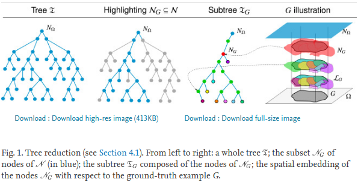
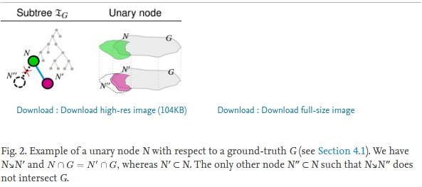
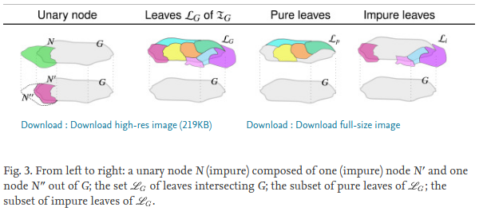

# Supervised quality evaluation of binary partition trees for object segmentation
Java implementation of [Supervised quality evaluation of binary partition trees for object segmentation](https://www.sciencedirect.com/science/article/pii/S0031320320304702) published in the Pattern Recognition journal in 2020.

## Authors
Jimmy Francky Randrianasoa, Pierre Cettour-Janet, Camille Kurtz, Éric Desjardin, Pierre Gançarski, Nathalie Bednarek, François Rousseau, Nicolas Passat

## Abstract
The binary partition tree (BPT) allows for the hierarchical representation of images in a multiscale way, by providing a tree of nodes corresponding to image regions. In particular, cuts of a BPT can be interpreted as segmentations of the associated image. Building the BPT of an image then constitutes a relevant preliminary step for optimization-based segmentation methods. A wide literature has been devoted to the construction of BPTs, and their involvement in such segmentation tasks. Comparatively, there exist few works dedicated to evaluate the quality of BPTs, i.e. their ability to allow further segmentation methods to compute good results. We propose such a framework for evaluating the quality of a BPT with respect to the object segmentation problem, i.e. the segmentation of one or several objects from an image. This framework is supervised, since the notion of segmentation quality is not only depending on the application but also on the user’s objectives, expressed via the chosen ground-truth and quality metric. We develop two sides within this framework. First, we propose an intrinsic quality analysis, that relies on the structural coherence of the BPT with respect to ground-truth. More precisely, we evaluate to what extent the BPT structure is well-matching such examples, in a set / combinatorial fashion. Second, we propose an extrinsic analysis, by allowing the user to assess the quality of a BPT based on chosen metrics that correspond to the desired properties of the subsequent segmentation. In particular, we evaluate to what extent a BPT can provide good results with respect to such metrics whereas handling the trade-off with the cardinality of the cuts.

## Illustrations

---

---

## Usage
Evaluating hierarchical tree stuctures such as :  
&bull; [BPT](https://github.com/yonmi/BinaryPartitionTree/blob/master/src/standard/sequential/BPT.java):</b> Binary Partition Tree  
&bull; [MBPT](https://github.com/yonmi/BinaryPartitionTree/blob/master/src/multi/sequential/MBPT.java):</b> Multi-feature Binary Partition Tree

<b>Language:</b> Java  
<b>Purpose:</b> Assessing the quality of BPT and MBPT for object segmentation  

<b>Core classes:</b>  
&bull; [SegReference](src/evaluation/datastructure/SegReference.java) 
&bull; [IntinsicEval](src/evaluation/IntrinsicEval.java)  
&bull; [ExtrinsicEval](src/evaluation/ExtrinsicEval.java)  

<b>Other classes:</b>  
&bull; [PerretEval](src/evaluation/PerretEval.java)  
&bull; [PonttusetEval](src/evaluation/PonttusetEval.java)  

<b>Project dependencies:</b>  
&bull; [Image](https://github.com/yonmi/Image)  
&bull; [BinaryPartitionTree](https://github.com/yonmi/BinaryPartitionTree)  

<b>Getting started:</b> you can start with some [examples](src/experiences)

## How to cite

    Jimmy Francky Randrianasoa, Pierre Cettour-Janet, Camille Kurtz, Éric Desjardin, Pierre Gançarski, Nathalie Bednarek, François Rousseau, Nicolas Passat,
    Supervised quality evaluation of binary partition trees for object segmentation,
    Pattern Recognition,
    2020,
    107667,
    ISSN 0031-3203,
    https://doi.org/10.1016/j.patcog.2020.107667.
    (http://www.sciencedirect.com/science/article/pii/S0031320320304702)

**bibtex**

    @article{RANDRIANASOA2020107667,
    title = "Supervised quality evaluation of binary partition trees for object segmentation",
    journal = "Pattern Recognition",
    pages = "107667",
    year = "2020",
    issn = "0031-3203",
    doi = "https://doi.org/10.1016/j.patcog.2020.107667",
    url = "http://www.sciencedirect.com/science/article/pii/S0031320320304702",
    author = "Jimmy Francky Randrianasoa and Pierre Cettour-Janet and Camille Kurtz and Éric Desjardin and Pierre Gançarski and Nathalie Bednarek and François    Rousseau and Nicolas Passat",
    }

